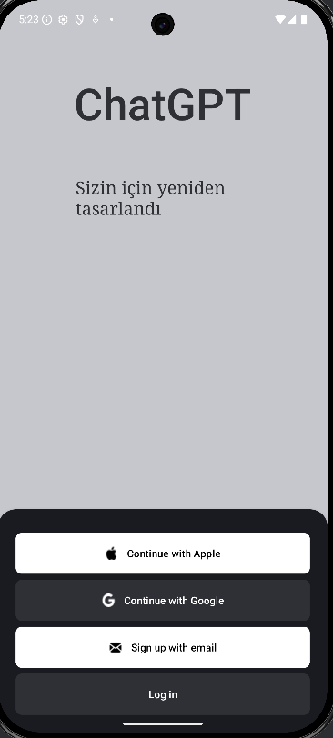
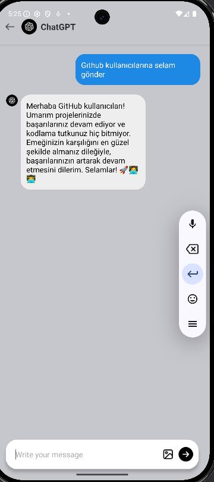
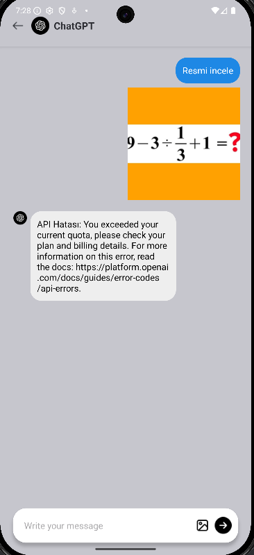

<h1 >ChatGPT Mobil Uygulaması</h1>

Bu projede ChatGPT uygulamasının mobil uygulaması tasarlanmıştır.

## Uygulama Görselleri
|             Giriş Ekranı             |                Metin Yükleme              |              Resim Yükleme               |
| :----------------------------------: | :---------------------------------------: |:---------------------------------------: |
|           |              |           |

 
<h2>Son Güncelleme (13.05.2025)</h2>
<ul>
  <li>Resim Yükleme ve İşleme Eklendi</li>
  <li>Open AI apisine geçiş yapıldı</li>
  <li>ÜCRETLİ APİ KEY OLMADIĞI İÇİN RESİM YÜKLEME ÖZELLİĞİNDE HATA VERİYOR</li>
</ul>
 
<h2>Uygulamanın Özellikleri (12.05.2025)</h2>
<ul>
  <li>Ana sayfa arayüzü ile kullanıcıyı uygulama hakkında bilgilendirme</li>
  <li>Chat sayfası ile soru sorabilme </li>
  <li>Geliştirilen tasarım sayesinde kolay kullanım</li>
</ul>
 
<h2>Geliştirilecek Özellikler</h2>
<ul>
  <li>Resim Yükleme (Eklendi 13.05.2025)</li>
  <li>Sesli Soru Sorma</li>
  <li>Hesap Oluşturma</li>
  <li>Kullanıcı Girişi Sayfası (Eklendi 12.05.2025)</li>
  <li>Profil Sayfası</li>
  <li>Geçmiş Sohbetler</li>
</ul>

